<picture>
  <source media="(prefers-reduced-motion: reduce) and (max-width: 767px) and (prefers-color-scheme: dark)" srcset="dark-mobile.svg#still" />
  <source media="(prefers-reduced-motion: reduce) and (max-width: 767px)" srcset="light-mobile.svg#still" />
  <source media="(prefers-reduced-motion: reduce) and (prefers-color-scheme: dark)" srcset="dark.svg#still" />
  <source media="(prefers-reduced-motion: reduce)" srcset="light.svg#still" />
  <source media="(max-width: 767px) and (prefers-color-scheme: dark)" srcset="dark-mobile.svg" />
  <source media="(max-width: 767px)" srcset="light-mobile.svg" />
  <source media="(prefers-color-scheme: dark)" srcset="dark.svg" />
  
</picture>

## About

**Data & AI Engineer**

I'm Mert Ali ERENTÜRK, a Data & AI Engineer. I work on data pipelines, lakehouse design and LLM applications.

I'm also working on mobile apps and LangGraph workflows. I care about where the data comes from, what happens when a job fails, and how to check an AI output.

## Architecture & System Design

<table width="100%">
<tr>
<td width="50%" valign="top">
<h3>Lakehouse Architecture</h3>

Raw, cleaned and serving layers, with clear rules for how data moves between them. Schema changes, table layout and data quality checks are the main design decisions.

</td>
<td width="50%" valign="top">
<h3>Big Data Ecosystems &amp; Data Platforms</h3>

How storage, distributed compute and orchestration fit together. Choosing batch or streaming based on the workload, rather than adding infrastructure by default.

</td>
</tr>
<tr>
<td width="50%" valign="top">
<h3>Data Flows &amp; Orchestration</h3>

Dependencies, incremental loads, retries and backfills. I pay particular attention to whether a failed run can be repeated without duplicating data.

</td>
<td width="50%" valign="top">
<h3>System Design</h3>

API boundaries, events and shared state between services. Keeping interfaces clear enough that one component can change without forcing changes everywhere else.

</td>
</tr>
<tr>
<td width="50%" valign="top">
<h3>AI Pipeline Design</h3>

Taking data through preparation, retrieval or inference, then evaluation. Recording which inputs, prompts and models produced a result makes debugging possible.

</td>
<td width="50%" valign="top">
<h3>LLM Application Architectures</h3>

Retrieval, context assembly, tool calls and structured responses. Testing what the application should do when context is missing or a model gives an unusable answer.

</td>
</tr>
<tr>
<td colspan="2" valign="top">
<h3>LangGraph Agent Workflows</h3>

State, routing and tool use in multi-step agent flows. Checkpoints and human review define where a workflow can pause, resume or ask for help.

</td>
</tr>
</table>

## Current Focus

### Mobile Application Development

Mobile interfaces, application state and API integration. I'm interested in how the client handles authentication, loading and failed requests.

### AI Pipelines & Agent Workflows

Connecting retrieval and tool calls into repeatable workflows, then checking the outputs. LangGraph is part of this work.

### Data Engineering Concepts

Lakehouse layouts, data models and batch or streaming jobs. Understanding when incremental processing helps and how to recover after a failed run.

## Connect

[Portfolio](https://mertalierntrk.dev/) · [GitHub](https://github.com/MertAErntrk) · [Email](mailto:mertali.erntrk@gmail.com)

